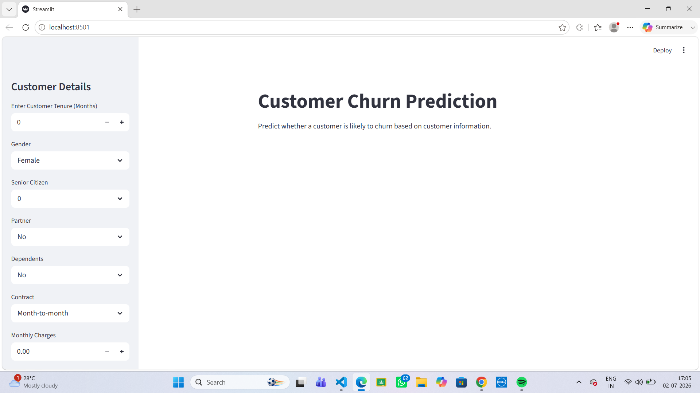
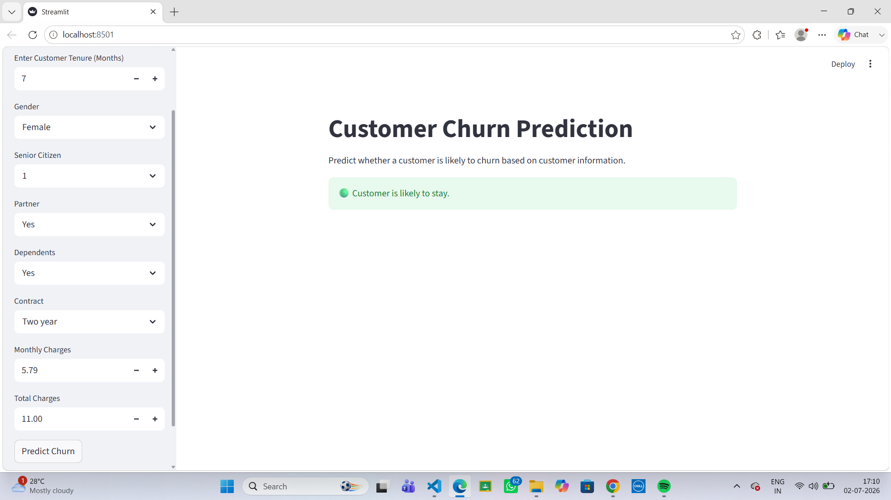
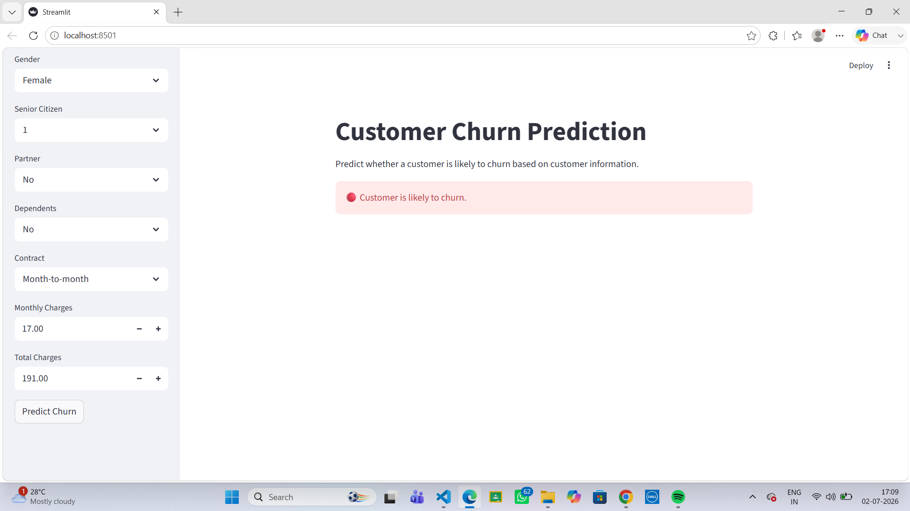

# Customer Churn Prediction using Machine Learning

## Overview

This project predicts whether a customer is likely to churn using machine learning techniques. It is built on the Telco Customer Churn dataset and covers the complete machine learning workflow, including data preprocessing, feature engineering, model training, evaluation, and deployment through a Streamlit web application.

This project was developed to strengthen my understanding of the complete machine learning workflow, from data preprocessing and model training to deploying a predictive web application using Streamlit

## Live Demo

The application is deployed on Streamlit Community Cloud.

**Live Application:** https://customer-churn-prediction-lfppes4p8gxzysxesmdopc.streamlit.app/

## Overview

This project predicts whether a customer is likely to churn...


## Live Demo

The application is deployed on Streamlit Community Cloud.

**Live Application:** https://customer-churn-prediction-lfppes4p8gxzysxesmdopc.streamlit.app/


## Features

- Data preprocessing and cleaning
- Label encoding for categorical variables
- Feature scaling using StandardScaler
- Random Forest Classifier for prediction
- Interactive Streamlit web application
- Real-time customer churn prediction
- Model persistence using Joblib


## Dataset

The project uses the **Telco Customer Churn Dataset**, which contains customer demographic information, subscription details, and billing information.

After preprocessing, the model was trained using the following features:

- Gender
- Senior Citizen
- Partner
- Dependents
- Tenure
- Contract
- Monthly Charges
- Total Charges


## Technologies Used

- Python
- Pandas
- NumPy
- Scikit-learn
- Streamlit
- Matplotlib
- Joblib
- Jupyter Notebook


## Project Structure

```text
customer-churn-prediction/
│
├── app.py
├── churn_prediction.ipynb
├── model.pkl
├── scaler.pkl
├── README.md
├── requirements.txt
├── data/
│   └── WA_Fn-UseC_-Telco-Customer-Churn.csv
├── outputs/
└── images/
```

## Machine Learning Workflow

1. Load the dataset
2. Handle missing values
3. Convert categorical variables into numerical values
4. Scale numerical features
5. Split the dataset into training and testing sets
6. Train a Random Forest Classifier
7. Evaluate model performance
8. Save the trained model
9. Deploy the model using Streamlit


## Running the Project

Clone the repository

```bash
git clone https://github.com/kuntlasrisahithi/customer-churn-prediction.git
```

Navigate to the project directory

```bash
cd customer-churn-prediction
```

Install the required libraries

```bash
pip install -r requirements.txt
```

Run the Streamlit application

```bash
python -m streamlit run app.py
```

## Application Preview

### Home Screen



### Prediction - Customer Likely to Stay



### Prediction - Customer Likely to Churn




## Future Improvements

- Compare multiple machine learning algorithms
- Perform hyperparameter tuning
- Display prediction probabilities
- Deploy the application online
- Improve the user interface with additional visualizations

## Author

**Kuntla Sri Sahithi**

Final Year B.Tech Student  
Computer Science and Engineering

GitHub: https://github.com/kuntlasrisahithi